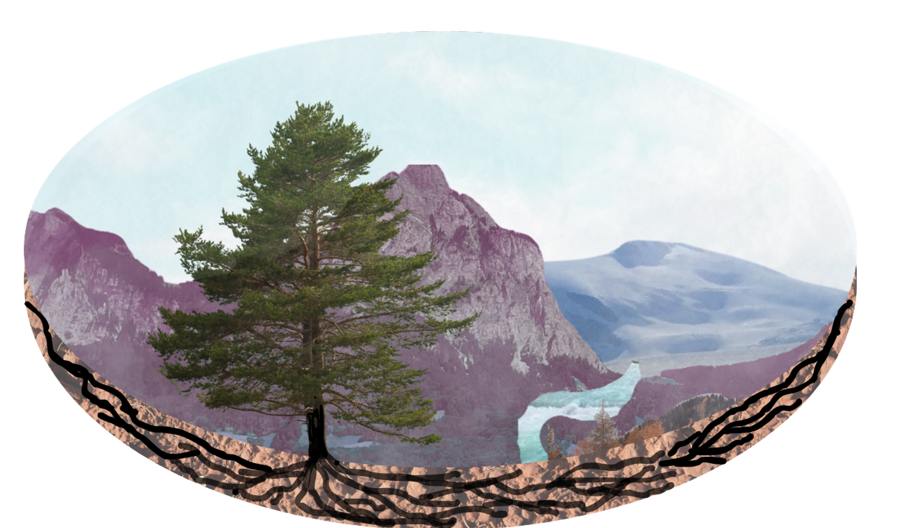

<p align="center">
  
</p>

# FORM resilience, recovery and resistance pipeline

This repository contains a flexible  Python-based workflow to generate mosaiced FORCE time series products for Switzerland (from local FORCE products locally downloaded for the FORM group at ETHZ) and compute forest resilience, recovery, and resistance metrics using Swiss NFI data (or any point data locations). 

## Requirements
- Anaconda or Miniconda
- Git

Python and all required libraries are installed via the conda environment.

---

## Step 1 Create the conda environment
From the repository root, create the environment using the provided yml file:

```bash        
conda env create -f force_mo_environment.yml
conda activate force_mo_environment
```
## Step 2 Mosaicing images
Go to Script 1, this will alow you to mosaic desired images for for selected years, date windows, and bands/indices (EVI, NDVI, and NDMI) once the paths are set.

```python
from pathlib import Path

in_root = Path(r"M:\FORCE_Sentinel_2_TSA_2017_2023\level3\tsa\real_values_flagged")
out_root = Path(r"S:\mbrown\Madi_sentinel_2_comp")

years = list(range(2017, 2024))

date_windows = [
    {"name": "aug", "start_mmdd": "08-01", "end_mmdd": "08-31"},
]

output_vars = ["CCI", "NIR", "GRN", "SW1"]
```
## Step 3 Extract NFI data
Go to Script 2 and download grid .gpkg from this repository  set set desired paths on local machine for NFI data, desired indices to extract, and  were you want csv containing indices to output (if you have already matched your nfi data to gpkg you can comment this part out)
```python
nfi_path = Path(r"C:\Users\mabrown\Desktop\P6_admin\nfi_data\correct_NFI.shp")
grid_path = Path(r"S:\mbrown\FORCE_TSA_processing\grid_ch.gpkg")

# Root folder where your processed composites live
comp_root = Path(r"S:\mbrown\Madi_sentinel_2_comp")

# Output csv
out_csv = comp_root / "nfi_raster_FORCE.csv"

# Which products to extract (must match folder names under comp_root)
products = ["CCI", "NIR", "GRN", "SW1", "NDVI", "EVI"]

# Which years/windows to extract
years = list(range(2017, 2023))
windows = ["aug"]  # match your date_windows "name"
```
## Step 4 Calculate indices for resilience, recovery, and resistance
## Step 5 Nice graph outputs/ modeling step


