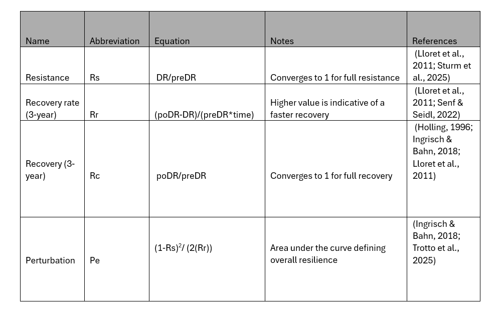
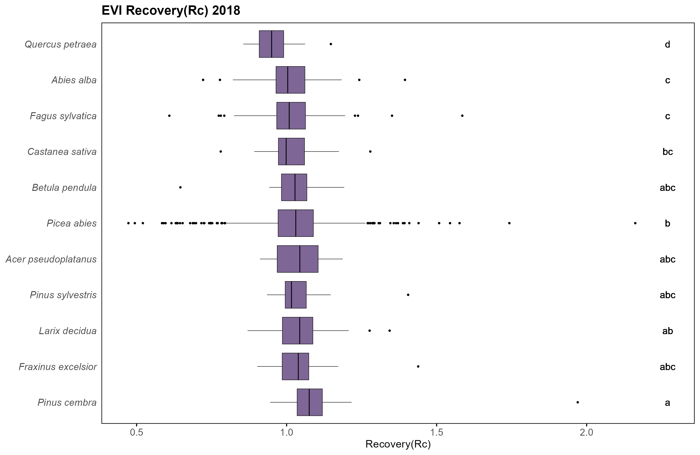

<p align="center">
  
</p>

# RE3: Resistance, Recovery, and Resilience Metric Pipeline 

This repository contains a flexible  Python-based workflow to generate composited  products for Switzerland from  FORCE Sentinel-2 [Franz et al. 2021](https://doi.org/10.1016/j.rse.2020.112128 ) (locallly available in the FORM group at ETHZ) and compute forest resistance, recovery, and resilience metrics using Swiss NFI data (or any point data locations). The original Sentinel-2 data comes from [Koch et al. (2024)](https://www.envidat.ch/#/metadata/sentinel-2-time-series-of-switzerland).

## Requirements
- Anaconda or Miniconda
- Git
- Python and all required libraries are installed via the conda environment.

---

##  1 Create the conda environment
From the repository root, create the environment using the provided yml file:

```bash        
conda env create -f force_mo_environment.yml
conda activate force_mo_environment
```
##  2 Composite images
Go to Script 1, this will alow you to composite desired images for for selected years,  date windows, bands/indices (EVI, NDVI, and NDMI), and tiles once the paths/paramters are set.

```python
from pathlib import Path

in_root = Path(r"M:\FORCE_Sentinel_2_TSA_2017_2023\level3\tsa\real_values_flagged")
out_root = Path(r"S:\mbrown\Madi_sentinel_2_comp")

years = list(range(2017, 2024))

date_windows = [
    {"name": "aug", "start_mmdd": "08-01", "end_mmdd": "08-31"},
]

output_vars = ["CCI", "NIR", "GRN", "SW1"]

# ----------------------------
# Tile selection find gpkg in repository so you can better identify tile locations
# ----------------------------
# Set to None to process all tiles
# Or provide a list like ["X1234_Y5678", "X2345_Y6789"]
selected_tiles: list[str] | None = None

```
## 3 Extract NFI data
Go to Script 2 and download grid .gpkg from this repository  set set desired paths on local machine for NFI data, desired indices to extract, and  were you want csv containing indices to output (if you have already matched your nfi data to gpkg you can comment this part out)
```python
nfi_path = Path(r"C:\Users\mabrown\Desktop\P6_admin\nfi_data\correct_NFI.shp")
grid_path = Path(r"S:\mbrown\FORCE_TSA_processing\grid_ch.gpkg")

# Root folder where your processed composites live
comp_root = Path(r"S:\mbrown\Madi_sentinel_2_comp")

# Output csv
out_csv = comp_root / "nfi_raster_FORCE.csv"

# Which products to extract (must match folder names under comp_root)
products = ["CCI", "NIR", "GRN", "SW1", "NDVI", "EVI"]

# Which years/windows to extract
years = list(range(2017, 2023))
windows = ["aug"]  # match your date_windows "name"
```
##  4 Compute resistance, recovery, and resilience 
Go to script 3 and set desired paths to location of csv from previous step, set disturbances years and calculate metrics of compute resistance, recovery, and resilience. Yay! Now you are ready for further analysis:)
  
</p>

```python
# 1) Input and output
in_csv = r"S:\mbrown\Madi_sentinel_2_comp\nfi_raster_FORCE.csv"
out_csv = r"S:\mbrown\Madi_sentinel_2_comp\nfi_indices_metrics_clean.csv"

# 2) Replace nodata with NaN
nodata_values = [-9999, -9999.0]

# 3) Disturbance setup: (pre_year, event_year, recovery_year) 
#My drought was in 2018 for this example 
# If a needed year column does not exist, the metric becomes NaN
events = [
    (2017, 2018, 2021),
]
```
## Step 5 Tree species metrics comparisons (optional)
You now have an analysis ready csv containing the desired metrics and are now ready for analysis. In script 4, we will switch it up and compare the varying tree species metrics using R ggplot2 and conduct a [Kruskal-Wallis](http://dx.doi.org/10.1080/01621459.1952.10483441) test (95 % CI) to see if there are statistically significant different between 11 dominant species in Switzerland . Change input and output file paths to your own, then set parameters for metrics, indices, and years you want to visualize. You end up with a series of plots for each metric (see below). 
<p align="center">
  
</p>

```R
# Uncomment only if you need to install packages
# install.packages(c("dplyr","tidyr","ggplot2","forcats","rstatix","multcompView"))

library(dplyr)
library(tidyr)
library(ggplot2)
library(forcats)
library(rstatix)
library(multcompView)

rm(list = ls())

# =========================
# User settings
# =========================
metric_data <- "S:/mbrown/Madi_sentinel_2_comp/nfi_indices_metrics_clean.csv"

# Base output folder (all subfolders will be created inside this)
out_dir <- "S:/mbrown/Madi_sentinel_2_comp/metric_plots"
dir.create(out_dir, recursive = TRUE, showWarnings = FALSE)


#11 most dominant species 
species_order <- c(
  "Abies alba","Larix decidua", "Picea abies", "Pinus cembra",
  "Pinus sylvestris","Acer pseudoplatanus", "Betula pendula",
  "Castanea sativa","Fagus sylvatica", "Fraxinus excelsior", "Quercus petraea"
)

# Set any of these to NULL to run everything available
indices_to_run <- c(NULL)  # or NULL
metrics_to_run <- c(NULL)             # Rs Rc Rr Pe, or NULL
years_to_run   <- c(2018)                   # or NULL

plot_width_in  <- 10
plot_height_in <- 6.5
plot_dpi       <- 300
```


## References

- Bloom et al. (2025). *Ecological Indicators*. https://doi.org/10.1016/j.ecolind.2025.113757  
- Frantz et al. (2021). *Remote Sensing of Environment*. https://doi.org/10.1016/j.rse.2020.112128  
- Gamon et al. (2016). *Proceedings of the National Academy of Sciences*. https://doi.org/10.1073/pnas.1606162113  
- Gaudel et al. (2017). *ISPRS Archives*. https://doi.org/10.5194/isprs-archives-xlii-1-w1-447-2017  
- Holling & Meffe (1996). *Conservation Biology*. https://www.jstor.org/stable/2386849  
- Ingrisch & Bahn (2018). *Trends in Ecology & Evolution*. https://doi.org/10.1016/j.tree.2018.01.013
- Koch et al. (2024).*EnviDat*.  https://www.doi.org/10.16904/envidat.511.
- Koch et al. (2025). *Remote Sensing*. https://doi.org/10.3390/rs17122094  
- Lloret et al. (2011). *Oikos*. https://doi.org/10.1111/j.1600-0706.2011.19372.x  
- Senf et al. (2021). *Global Ecology and Biogeography*. https://doi.org/10.1111/geb.13406    
- Sturm et al. (2022). *Global Change Biology*. https://doi.org/10.1111/gcb.16136
- Sturm et al. (2025). *Agricultural and Forest Meteorology*.https://doi.org/10.1111/gcb.16136](https://doi.org/10.1016/j.agrformet.2025.110756
- Trotto et al. (2025). *Ecological Indicators*. https://doi.org/10.1016/j.ecolind.2025.114382


